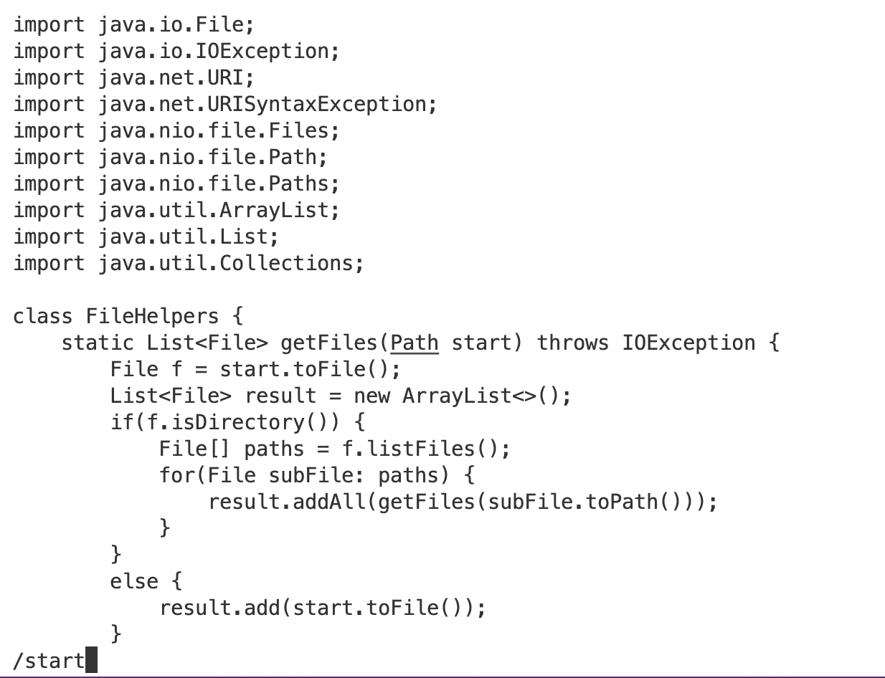
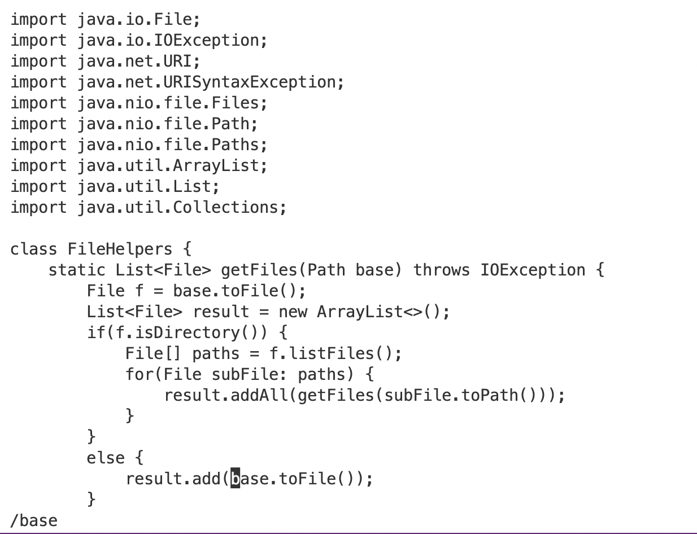

# Lab Report Week 7

## Part 1

We chose to complete task 1 from the week 6 lab. 

The shortest vim command of our group is 

```vim<space>D<tab><enter>/start<enter>cebase<esc>n.n.:wq<enter>```

We first used the terminal command ```vim<space>D<tab><enter>``` to access the java file ```DocSearchServer.java```.


After that, we write ```/start``` to search for the keyword ```start```. 



Enter ```cebase``` to change the parameter ```start``` to ```base```.


Then we hit ```<esc>``` to exit the input mode.

We repeat the above process by entering ```n.n.``` and change the other two ```start``` to ```base```.
  

  


Then we use ```:wq<enter>``` to save and exit.


## Part 2
  
The first method took 2 minutes and 25 seconds, while the second method only took 1 minute and 40 seconds.
  
The first method was taking more time because I had to scp the file to the remote server and then run it there.
  
The second method does not need to do the scp process and can just edit and run the file on the remote server directly.
  
If I had to work on a progrma that I was running remotely, I will prefer to use the second method because it is much faster.

If the task is easier to be done locally, I might have to choose the first method. For example, it is easy to debug, test, and switch files locally.
