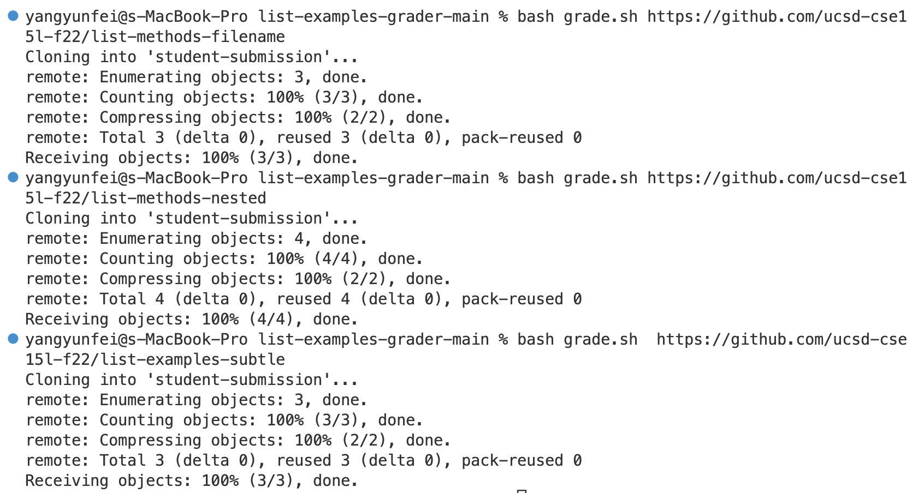
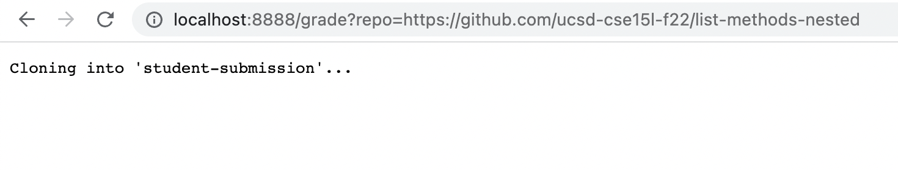
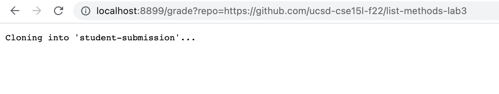
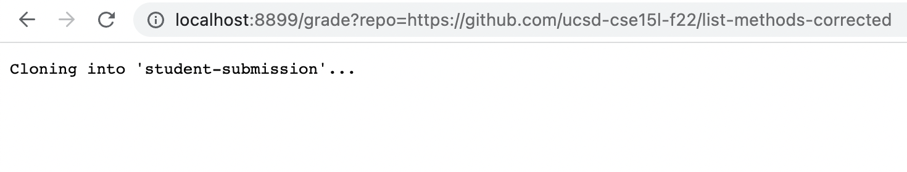

# Lab Report 5

This lab report covers the ```grade.sh``` examples from lab 7.










[Lab Reports](https://github.com/fergusyyang/cse15l-lab-reports)

[Lab Report 0](https://github.com/fergusyyang/cse15l-lab-reports/blob/main/week-0-lab.md)

[Lab Report 1](https://github.com/fergusyyang/cse15l-lab-reports/blob/main/lab-report-1.md)

[Lab Report 2](https://github.com/fergusyyang/cse15l-lab-reports/blob/main/week3-lab.md)

[Lab Report 3](https://github.com/fergusyyang/cse15l-lab-reports/blob/main/Lab%20report%203.md)

[Lab Report 4](https://github.com/fergusyyang/cse15l-lab-reports/blob/main/Lab%20Report%204.md)
