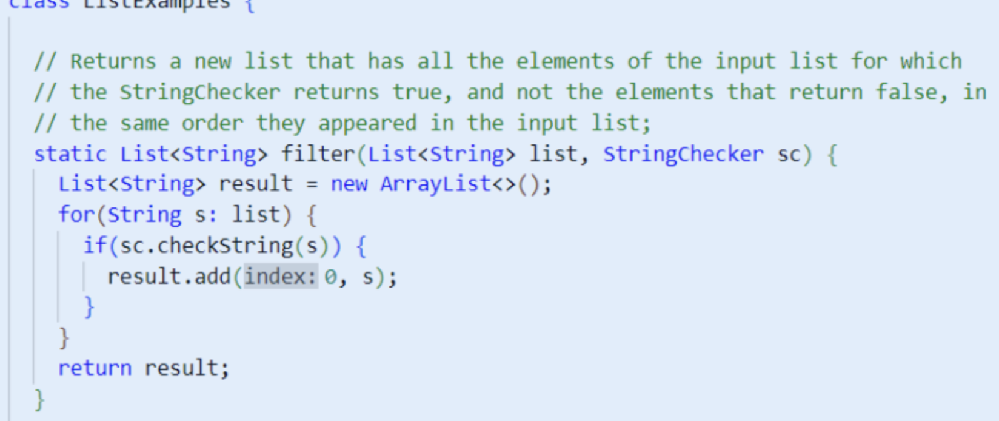
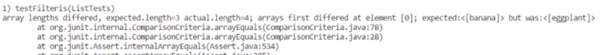
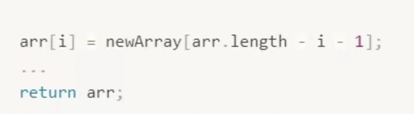

# Lab Report Week 3

## Part 1

```
public String handleRequest(URI url) {
        if (url.getPath().equals("/")) {
            return String.format("Number: %d", num);
        } else if (url.getPath().equals("/increment")) {
            num += 1;
            return String.format("Number incremented!");
        } else {
            System.out.println("Path: " + url.getPath());
            if (url.getPath().contains("/add")) {
                String[] parameters = url.getQuery().split("=");
                if (parameters[0].equals("count")) {
                    num += Integer.parseInt(parameters[1]);
                    return String.format("Number increased by %s! It's now %d", parameters[1], num);
                }
            }
            if (url.getPath().contains("/add")) {
                String[] parameters = url.getQuery().split("=");
                if (parameters[0].equals("s")) {
                    arr.add(parameters[1]);
                    return String.format((parameters[1])+ " is added to the list! Current list: " + arr);
                }
            }
            if (url.getPath().contains("/search")) {
                String[] parameters = url.getQuery().split("=");
                if (parameters[0].equals("s")) {
                    String result = "";
                    for (String element : arr){
                        if (element.contains(parameters[1])){
                            result = result + " " + element;
                        }
                    }
                    return result;
                }
            }
            return "404 Not Found!";
        }

    }
}
```

This is the code of the search engine.


Above is the add method. We are adding "banana" to the list.
I also showed that now we have "apple", "pineapple", "banana" in the list.


Above is the search method that we are searching "a" from the list above.
We found "apple", "pineapple", "banana" from the list.


Above is the search method that we are searching "apple" from the list.
This time we only found "apple", "pineapple" from the list.


## Part 2

### Bug 1 - filter


Above is the failure-inducing input. The input is {"apple", "banana", "cheery", "dragon fruit", "eggplant"}.



In this bug code above, the expected is banana, but the actual is eggplant.



Above is the symptom(output of the test).

The bug is causing this output because 

### Bug 2 - reversed


In this bug code, the goal is to return the new array, but the code actually returned the old array. 



[Lab Reports](https://github.com/fergusyyang/cse15l-lab-reports)

[Lab Report 0](https://github.com/fergusyyang/cse15l-lab-reports/blob/main/week-0-lab.md)

[Lab Report 1](https://github.com/fergusyyang/cse15l-lab-reports/blob/main/lab-report-1.md)
